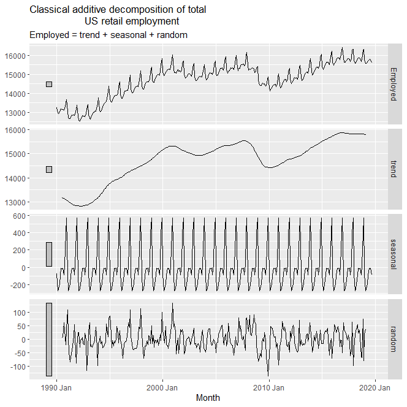
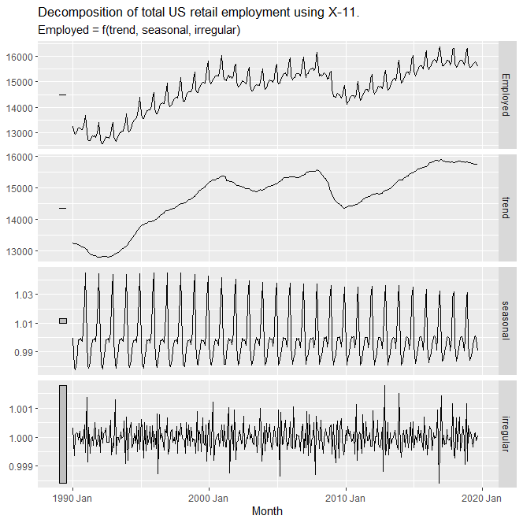

# Time Series Decomposition

Calendar adjustments and population adjustments are among the most common adjustments made to time series data.

STL Decomposition - Seasonal and Trend Decomposition using Loess
```
dcmp <- us_retail_employment |>
  model(stl = STL(Employed))
components(dcmp)
```


All the components of the time series are plotted.

Season adjusted values are also provided as an output of the STL model.

## Moving Averages

Moving average of order m can be written as

$$
\hat{T_t} = \frac{1}{m} \sum_{j=-k}^{k} y_{t+j}
$$

where $m=2k+1$ is the window length.

Trend cycles can be estimated using moving averages.

## Classical Decomposition

Steps:
- For trend, calculate using $2 \times m$-moving average if $m$ is an even number. $m$-moving average if $m$ is an odd number. $m$ is 4 for quarterly data, 7 for weekly, etc.
- For seasonal component, use average of detrended values.
- Remainder is simply $\hat{R_t} = y_t - \hat{T_t} - \hat{S_t}$ 

```
us_retail_employment |>
  model(
    classical_decomposition(Employed, type = "additive")
  ) |>
  components() |>
  autoplot() +
  labs(title = "Classical additive decomposition of total
                  US retail employment")
```


Similarly, you can do for multiplicative decomposition.

## Methods used by official statistics agencies

### X-11
One method, called the **X-11** method, improves upon some lacunae in the classical method. Used as follows. You may need to install `seasonal` package for this.
```
x11_dcmp <- us_retail_employment |>
  model(x11 = X_13ARIMA_SEATS(Employed ~ x11())) |>
  components()
autoplot(x11_dcmp) +
  labs(title =
    "Decomposition of total US retail employment using X-11.")
```


### Seats

Seats method developed in Bank of Spain.
```
seats_dcmp <- us_retail_employment |>
  model(seats = X_13ARIMA_SEATS(Employed ~ seats())) |>
  components()
autoplot(seats_dcmp) +
  labs(title =
    "Decomposition of total US retail employment using X-11.")
```



