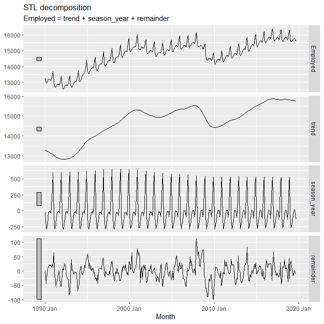

# Time Series Decomposition

Calendar adjustments and population adjustments are among the most common adjustments made to time series data.

STL Decomposition decomposes a time series into Season, Trend, and (something.)
```
dcmp <- us_retail_employment |>
  model(stl = STL(Employed))
components(dcmp)
```

All the components of the time series are plotted.

Season adjusted values are also provided as an output of the STL model.

## Moving Averages

Moving average of order m can be written as

$$
\hat{T_t} = \frac{1}{m} \sum_{j=-k}^{k} y_{t+j}
$$

where $m=2k+1$ is the window length.

Trend cycles can be estimated using moving averages.